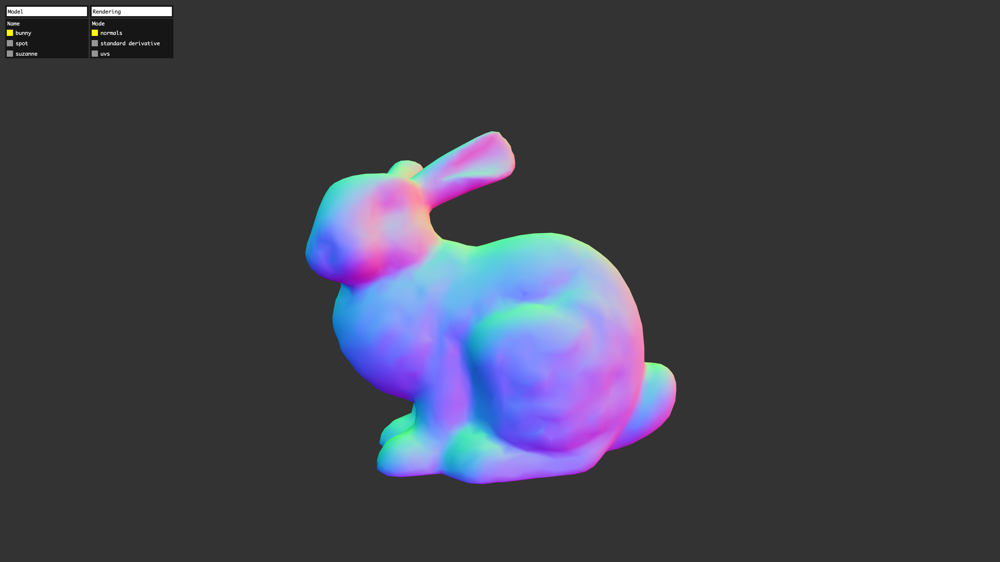

# geom-parse-obj

Parse [Wavefront .obj](https://github.com/vorg/geom-parse-obj) geometry file.

This parser support multiple meshes in one file via `g` sections in the OBJ file.



## Installation

```bash
npm install geom-parse-obj
```

## Usage

```js
import parseObj from "geom-parse-obj";

const objString = await (await fetch("file.obj")).text();
const obj = parseObj(objString);
// => {
//   positions: new Float32Array([x, y, z, x, y, z, ...])
//   normals: new Float32Array([x, y, z, x, y, z, ...])
//   uvs: new Float32Array([u, v, u, v, ...])
//   cells: new Uint32Array([i, j, k, i, j, k, ...])
// }
```

## API

#### `parseObj(objString): geometry | geometry[]`

**Parameters**

- objString: `string` - UTF8 encoded string with the contents of OBJ file

**Returns**

`geometry|geometry[]`: one or more simplicial complex geometry depending if groups are present in the file.

## License

MIT. See [license file](https://github.com/vorg/geom-parse-obj/blob/master/LICENSE.md).
